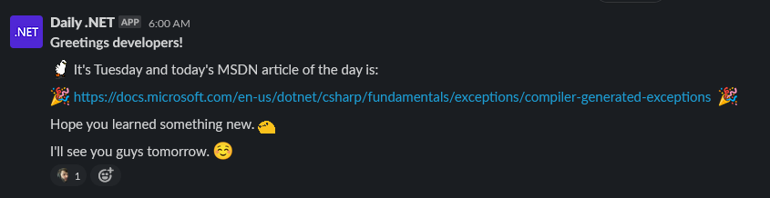

## Dotnet Daily

A simple application to generate a simple Message Of The Day with a random C# MSDN article in it.



_Great if you want to learn something new every day._

### Integration

By default, Slack integration is assumed, and a Slack Webhook URL is required.

The application also assumes some Slack-specific emojis that you might not have. You can always edit the `personality.json` file to change them.

### Scheduling

The application does not contain any scheduling logging. It is recommended to use [`crontab`](https://linuxhandbook.com/crontab/) or `windows scheduler` to schedule this application.

Here are some `crontab` scheduling examples:

**Run Monday - Friday, 6 AM (System TimeZone):**

```cron
0 6 * * 1,2,3,4,5 /var/www/dotnet-daily/dotnet-daily
```

**Run Every minute:**

```cron
*/1 * * * * /var/www/dotnet-daily/dotnet-daily
```

### Building

To build this application, you need to have [.NET 5 SDK](https://dotnet.microsoft.com/download/dotnet/5.0) installed on your machine.

### Vision

I want to give the messages a bit more personality. Jokes, more greetings, more complex message structure, etc. etc.

If you'd like to help, or have a nice idea/comment/suggestion feel free to [open a new issue].

And of course thank you so much for your interest. ❤
